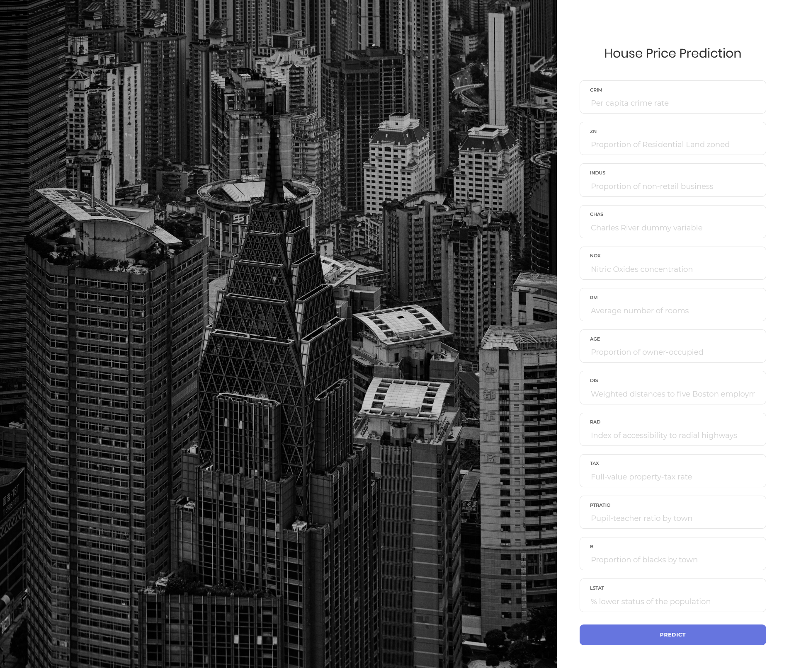
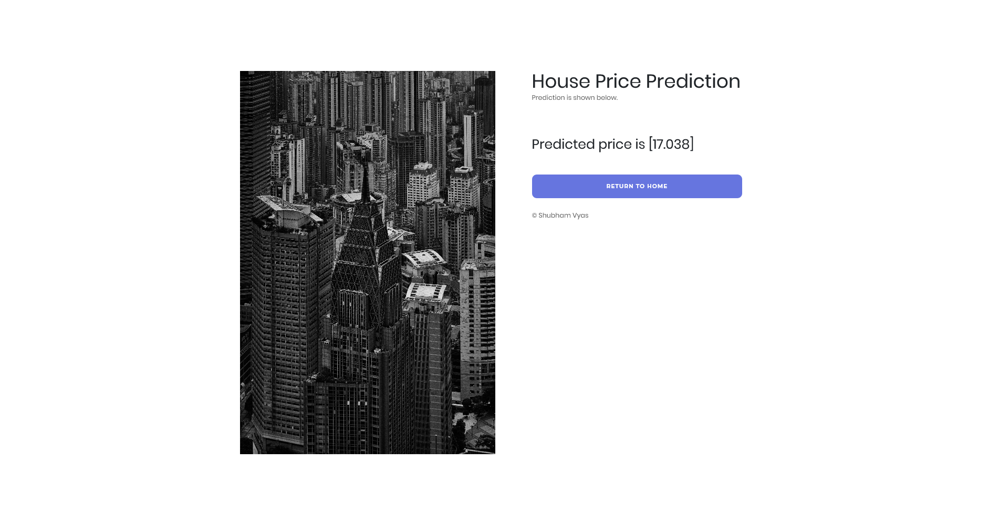

# HousePricePrediction_website
House Price Prediction using Django and Heroku to host. 
The Web App uses UCI Boston dataset as inputs and predicts the output using RandomForestRegressor.

## Home page
This takes 13 parameters which are from the UCI Boston dataset.

## Results
the predicted value od MEDV( _Median value of owner-occupied homes in $1000's_ ) is shown as below.

